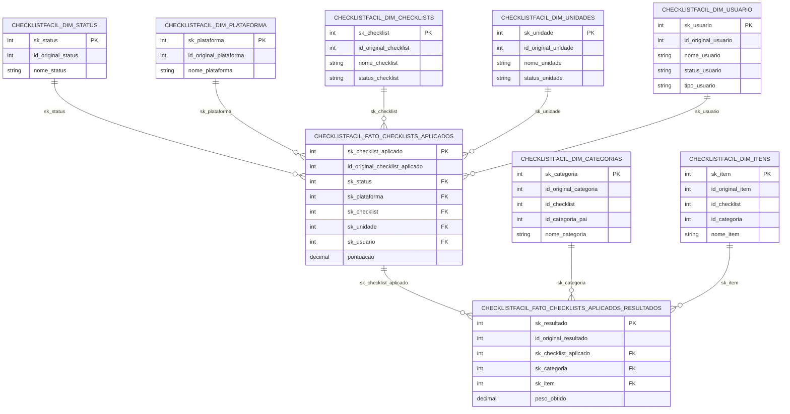

# Diagrama de tabelas - Camada GOLD

A modelagem abaixo representa os relacionamentos lógicos das tabelas Gold do projeto CHECKLIST_FACIL.

## Notas

- O relacionamento entre `dim_itens` e `dim_categorias` também existe de forma lógica por `id_categoria`, embora não esteja materializado por `sk` na fato principal.
- O relacionamento entre `dim_categorias` e `dim_checklists` também é lógico por `id_checklist`.
- Todas as `sk_*` são derivadas por `crc32` do ID original nos notebooks Gold.
